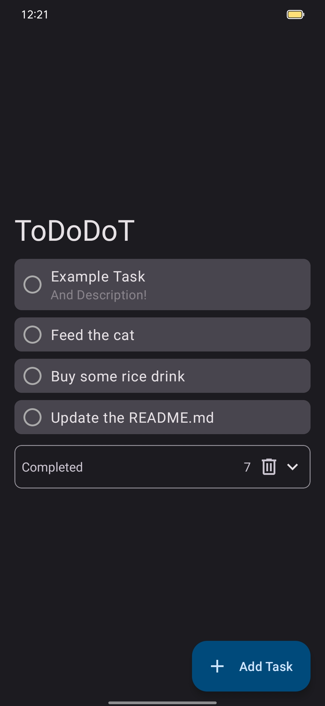

<!--
*** Thanks for checking out the Best-README-Template. If you have a suggestion
*** that would make this better, please fork the repo and create a pull request
*** or simply open an issue with the tag "enhancement".
*** Don't forget to give the project a star!
*** Thanks again! Now go create something AMAZING! :D
-->

<!-- PROJECT SHIELDS -->
<!--
*** I'm using markdown "reference style" links for readability.
*** Reference links are enclosed in brackets [ ] instead of parentheses ( ).
*** See the bottom of this document for the declaration of the reference variables
*** for contributors-url, forks-url, etc. This is an optional, concise syntax you may use.
*** https://www.markdownguide.org/basic-syntax/#reference-style-links
-->
<!-- [![Contributors][contributors-shield]][contributors-url] -->
[![Forks][forks-shield]][forks-url]
[![Stargazers][stars-shield]][stars-url]
[![Issues][issues-shield]][issues-url]
[![MIT License][license-shield]][license-url]
[![LinkedIn][linkedin-shield]][linkedin-url]

<!-- PROJECT LOGO -->
 

  

  <h3 align="center">ToDoDoT</h3>

  

    A simple to-do app!
     
    <a href="https://github.com/EliotAku/ToDoDoT"><strong>See Wiki</strong></a>
    •
    <a href="https://github.com/EliotAku/ToDoDoT/issues">Report Bug</a>
    •
    <a href="https://github.com/EliotAku/ToDoDoT/issues">Request Feature</a>
  

<!-- TABLE OF CONTENTS -->

  
Table of Contents

  <ol>
    <li>
      <a href="#about-the-project">About The Project</a>
      <ul>
        <li><a href="#built-with">Built With</a></li>
      </ul>
    </li>
    <li><a href="#roadmap">Roadmap</a></li>
    <li><a href="#license">License</a></li>
    <!-- <li><a href="#contact">Contact</a></li> -->
    <!-- <li><a href="#acknowledgments">Some Projects I Like</a></li> -->
  </ol>

<!-- ABOUT THE PROJECT -->
## About The Project

<!-- [![Product Name Screen Shot][product-screenshot]](https://example.com) -->

  

(It's my first app)

(<a href="#top">back to top</a>)

### Built With

* [Kotlin](https://kotlinlang.org/)
* [Room](https://developer.android.com/training/data-storage/room)

(<a href="#top">back to top</a>)

<!-- ROADMAP -->
## Roadmap

- [x] Add, remove, & modify tasks
- [x] Reordering tasks
- [x] Delete all checked tasks
- [ ] Select tasks and delete them
- [ ] Add subtasks
- [ ] Multi-language Support
    - [x] English
    - [ ] French

See the [open issues](https://github.com/othneildrew/Best-README-Template/issues) for a full list of proposed features (and known issues).

(<a href="#top">back to top</a>)

<!-- LICENSE -->
## License

Distributed under « NO LICENSE ». See `LICENSE.txt` for more information.

(<a href="#top">back to top</a>)

<!-- CONTACT -->
<!--
## Contact

Me - [@YashuKoh](https://twitter.com/YashuKoh)

Project Link: [https://github.com/EliotAku/ToDoDot](https://github.com/EliotAku/ToDoDoT)

(<a href="#top">back to top</a>)

-->

<!-- ACKNOWLEDGMENTS -->
<!--
## Some Projects I Like

Use this space to list resources you find helpful and would like to give credit to. I've included a few of my favorites to kick things off!

* [Choose an Open Source License](https://choosealicense.com)
* [GitHub Emoji Cheat Sheet](https://www.webpagefx.com/tools/emoji-cheat-sheet)
* [Img Shields](https://shields.io)
* [GitHub Pages](https://pages.github.com)

(<a href="#top">back to top</a>)

-->

<!-- MARKDOWN LINKS & IMAGES -->
<!-- https://www.markdownguide.org/basic-syntax/#reference-style-links -->
[contributors-shield]: https://img.shields.io/github/EliotAku/ToDoDoT.svg?style=flat
[contributors-url]: https://github.com/EliotAku/ToDoDoT/graphs/contributors
[forks-shield]: https://img.shields.io/github/forks/EliotAku/ToDoDoT.svg?style=flat
[forks-url]: https://github.com/EliotAku/ToDoDoT/network/members
[stars-shield]: https://img.shields.io/github/stars/EliotAku/ToDoDoT.svg?style=flat
[stars-url]: https://github.com/EliotAku/ToDoDoT/stargazers
[issues-shield]: https://img.shields.io/github/issues/EliotAku/ToDoDoT.svg?style=flat
[issues-url]: https://github.com/EliotAku/ToDoDoT/issues
[license-shield]: https://img.shields.io/github/license/EliotAku/ToDoDoT.svg?style=flat
[license-url]: https://github.com/EliotAku/ToDoDoT/blob/master/LICENSE.txt
[linkedin-shield]: https://img.shields.io/badge/-LinkedIn-black.svg?style=flat&logo=linkedin&colorB=555
[linkedin-url]: https://linkedin.com/
[product-screenshot]: screenshots/img_main.jpg
